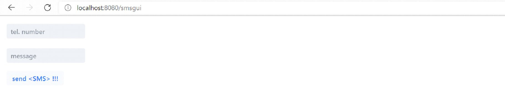

SERIAL PORT

The application uses a GSM 3G/4G modem connected to a computer (laptop) via a USB connector.
This is the simplest SMS frame that allows you to send and read SMS messages through your browser.
The application uses springboot and vaadin.

to send SMS go to: http://localhost:8080/smsgui
to read SMS go to: http://localhost:8080/readsmsgui

In ModemConnection You will need set the serial port,
check in the computer device manager which port is assigned to the modem.
You also need to set a modem phone number.

HAVE A FUN!

